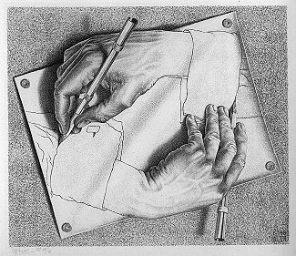

# songrim

SonGrim is MSPaint-like drawing component for React. It provides a simple interface for drawing on a canvas, and it supports loading/saving the drawing as a data URL.

> 'son' means 'hand' in Korean, and 'grim' means 'drawing' in Korean. So, 'songrim' means 'drawing by hand' in Korean.

[](https://mcescher.com/gallery/back-in-holland/#iLightbox[gallery_image_1]/31)

## Getting Started

Install dependency:
```console
$ npm install @iolo/songrim
```

Import and use the component:
```jsx
import { SonGrim } from '@iolo/songrim';

function App() {
  return (<SonGrim onChange={(dataUrl) => console.log(dataUrl)} />);
}
```

That's it! You can now draw on the canvas and save your drawing as a data URL.

You can use `useRef` to get the reference of the SonGrim component and call its methods to manipulate the drawing
programmatically.

```jsx
import { useRef } from 'react';
import { SonGrim, SonGrimRef, loadImage, saveImage } from '@iolo/songrim';
function App() {
  const sonGrimRef = useRef<SonGrimRef>(null);

  const handleSave = () => {
    if (sonGrimRef.current) {
      const dataUrl = sonGrimRef.current.getDataUrl(); // get the drawing as data URL
      saveImage(dataUrl, 'drawing.png'); // download(save on local) the image as file
    }
  };

  const handleOpen = async (event) => {
    const file = event.target.files[0];
    const dataUrl = await loadImage(file); // load the image file as data URL
    sonGrimRef.current?.setDataUrl(dataUrl); // load the data URL into SonGrim
  };

  return (
    <>
      <SonGrim
        ref={sonGrimRef}
        width={500}
        height={500}
        tool="pen"
        strokeColor="#000000"
        strokeWidth={2}
        fillColor="#ff0000"
        backgroundColor="#ffffff"
        dataUrl="" // initial data URL
      />
      <button onClick={handleSave}>Save</button>
      <input type="file" id="fileInput" onChange={handleOpen} />
    </>
  );
}
```

## Features

- Pen, Spray, Eraser, Spoid(Picker), Fill, Line, Rectangle, Circle(Ellipse) tools
- Paint-style layout: tools at top-left, controls below tools, drawing area on the right, colors at bottom-left, and palette at bottom-right
- SVG-based tool and action icons styled with CSS
- Stroke width control
- Shared 32-color palette for stroke and fill
- Current stroke/fill previews with swap action
- Custom color dialog with RGBA sliders and HEX input
- Background color property support
- Undo/Redo
- Load/Save drawing as data URL
- Utilities for manipulating/loading/saving images

## Tech Stack

### Frontend

- [typescript](https://www.typescriptlang.org/)
- [react](https://reactjs.org/) - UI library


### Testing

- [vitest](https://vitest.dev/) - Unit testing
- [playwright](https://playwright.dev/) - E2E testing

### Build

- [vite](https://vitejs.dev/)

## Guidelines

- Keep it simple and minimal.

---

May the **SOURCE** be with you!
